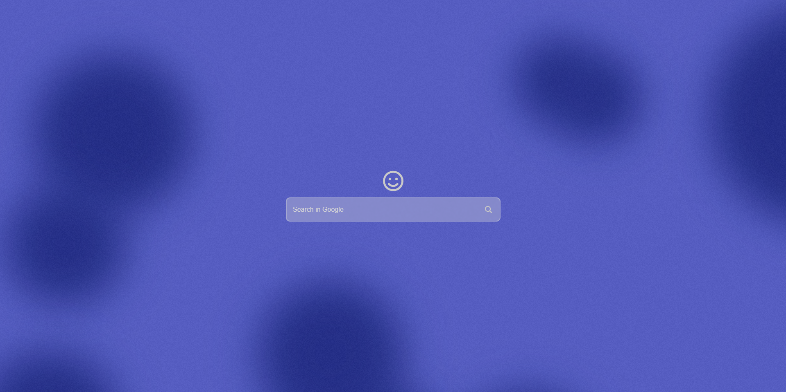
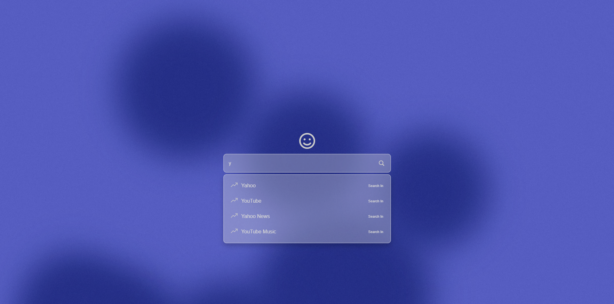
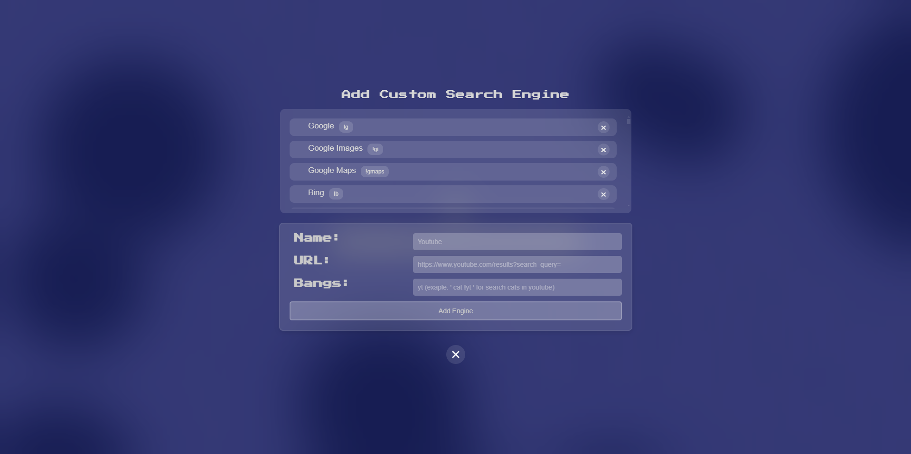
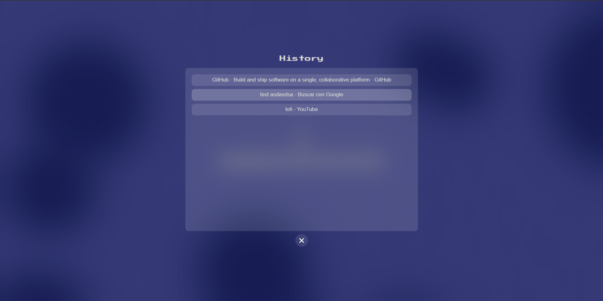
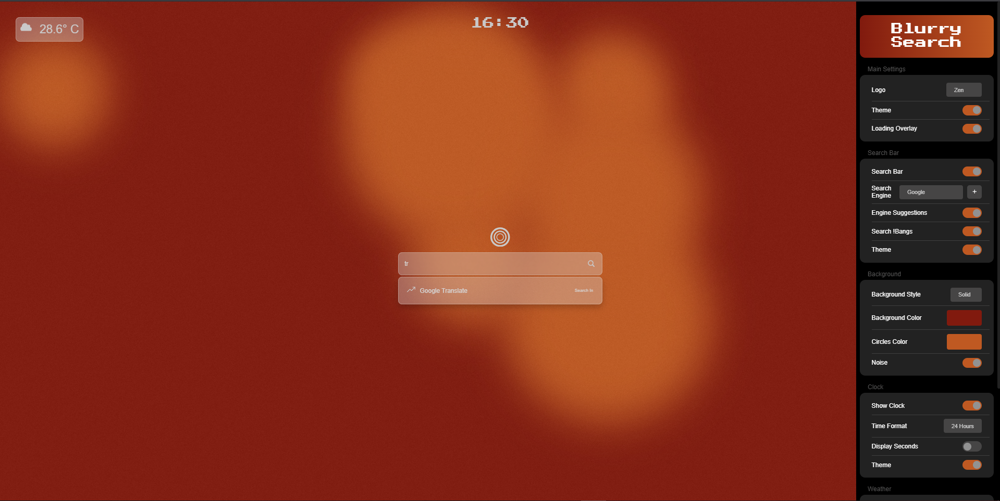
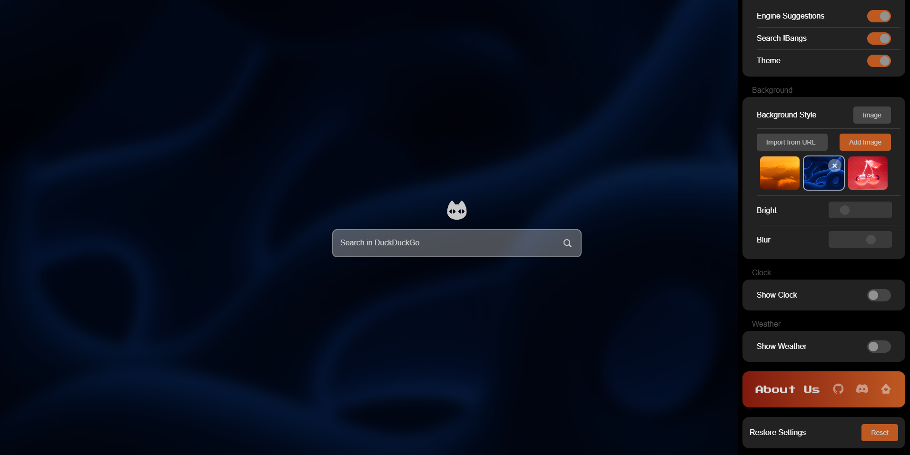

# Blurry Search

**Blurry Search** is a browser extension that replaces browser default new tab page with a fully customizable interface. Enjoy a unique experience with a refreshed home screen designed to be both functional and visually appealing.

## Features

- **Customizable Colors and Themes:** Adjust the appearance to match your style.
- **Weather, Clock & History:** View current weather, a real-time clock, and your browsing history.
- **Custom Backgrounds:** Set your preferred solid/image background.
- **Custom Search Engines:** Add and manage search engines tailored to your needs.
- **!Bangs:** Use quick search shortcuts similar to DuckDuckGo for faster access to various services.

## Installation
1. **Download the latest version of BlurrySearch in** [latest realases](https://github.com/NicouHc/BlurrySearch/releases/tag/BlurrySearch)
2. **Extract** the contents of the zip file to a folder on your computer.
3. Open your browser and navigate to `chrome://extensions` .
4. **Enable Developer Mode** by toggling the switch in the top-right corner.
5. Click on **"Load unpacked"**.
6. **Select the folder** where you extracted the extension.
7. The extension should now be installed and active in your browser.

## FAQ
- To open the **personalization menu**, go to the bottom right corner of the screen and click the settings button.
- To open **History**, click the logo.

## Preview

## More Info
 
  - if you have any question you can join our [Discord](https://discord.com/invite/63EUyQBZPm) ❤️
  - Buy me a coffe: [Paypal](https://www.paypal.com/donate/?hosted_button_id=UBDDRKEZ4XABE)

  
 

